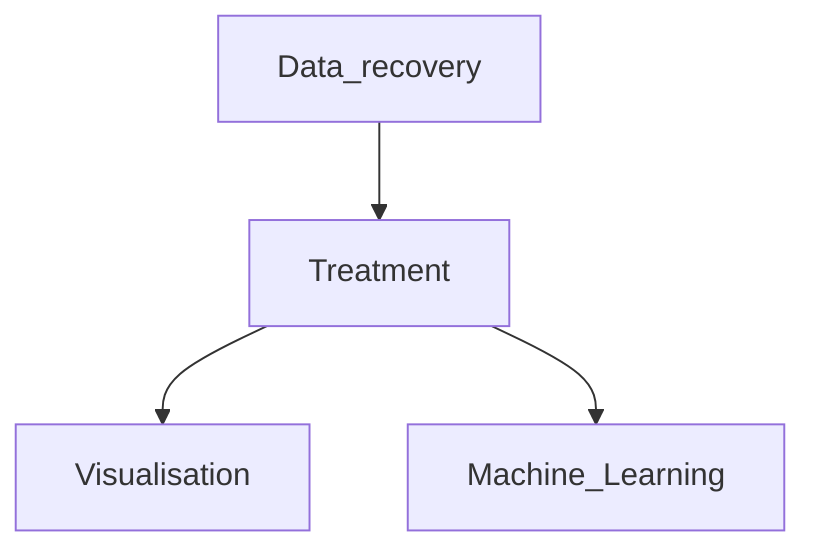

## Hello,
## I'm TCHAPPI Romaric
I'm passionate about data science and Machine Learning 

## About me
- 🔭 I’m currently a Master student at HETIC
- 🌱 I’m currently learning **data scicence and Artificial Intelligence**

### LANGUAGES AND TOOLS:

#### Development environment : 
**- VsCode:**<code></code>

#### Data recovery : 
**- PostgreSQL:** <code></code> **- MySQL:** <code></code>

#### Data processing : 
**- Numpy:**<code></code> <code></code>

#### Data Visualisation :  
**- Matplotlib:**<code></code>
<!-- <code></code> -->

#### Machine Learning : 
**- Scikit-Learn:**<code></code> 

## GitHub Statistics  

